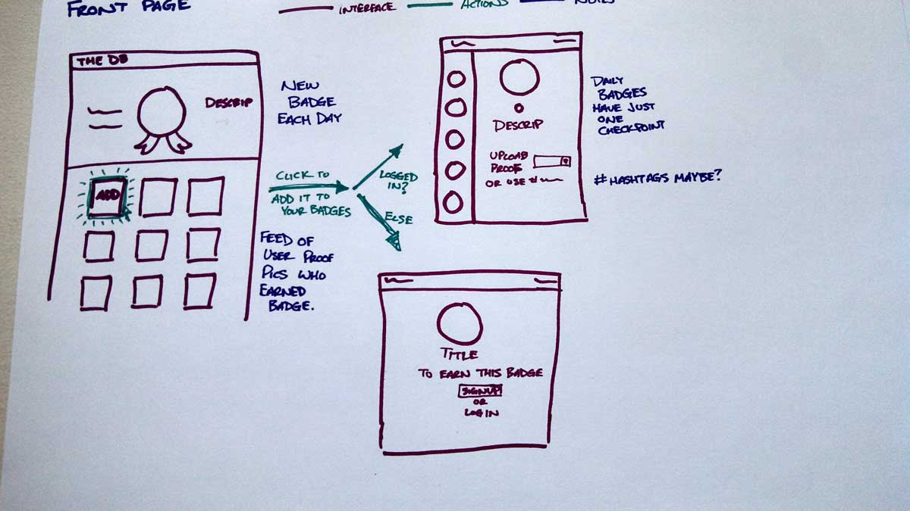
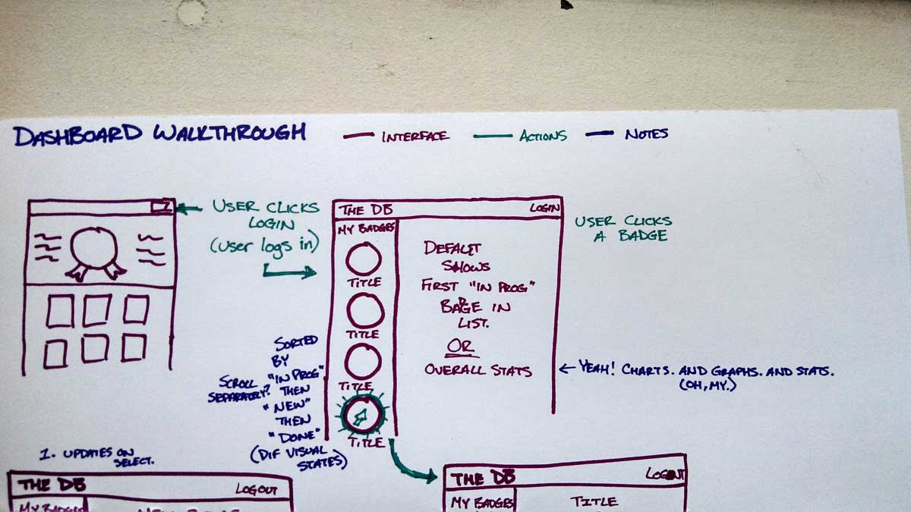
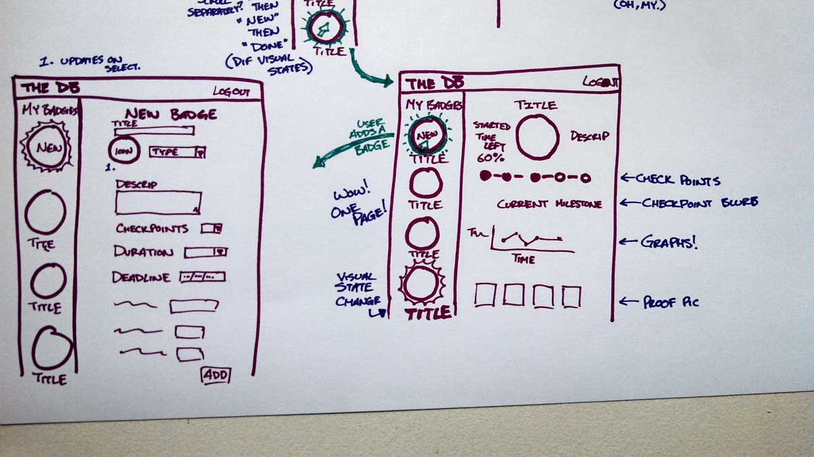

# The Daily Badge

The Daily Badge is a way to set and organize goals and then gamify the process of acheiving them.
 
"Badgers" take and post photos as proof to earn/claim badges.
 
Every day the app will post a daily badge for badgers to earn (to keep people coming back!)

### Technologies Used

* Ruby on Rails
* Backbone.js
* Unit testing with Rspec
* Acceptance testing with Capybara

---

**Check out the stories on Pivotal Tracker**
[The Daily Badge](https://www.pivotaltracker.com/s/projects/1053290 "User Stories")

## Walkthrough Wireframes

